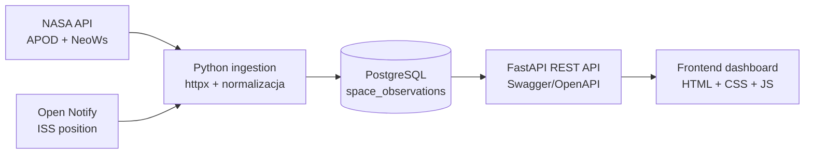

# Architektura

## C4 - Container View

## Przeplyw danych

1. Klient ingestion pobiera JSON z zewnetrznych API.
2. Normalizatory wybieraja potrzebne pola i zachowuja surowy payload do audytu.
3. Dane trafiaja do PostgreSQL jako rekordy obserwacji.
4. FastAPI wystawia endpointy REST i dokumentacje Swagger pod `/docs`.
5. Frontend pobiera dane z backendu i pokazuje dashboard.
